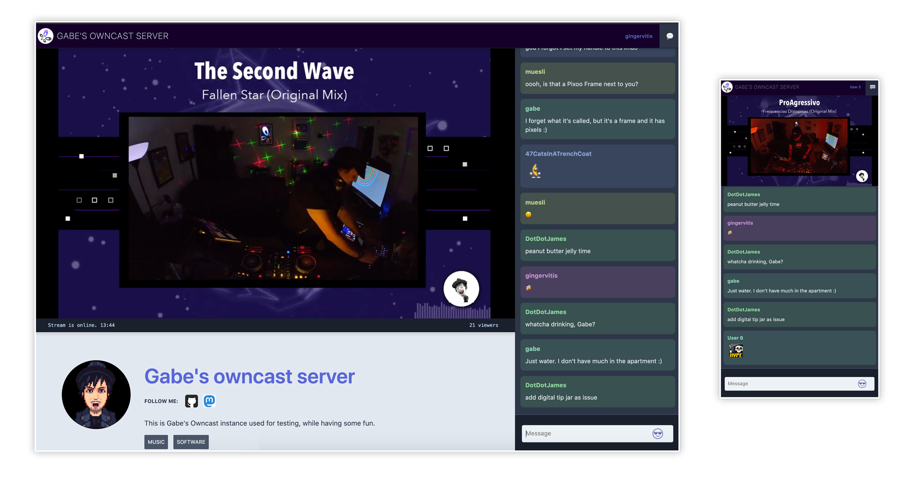

# Owncast CI/CD pipeline

Deploy Owncast server with CI/CD on Elestio

 
 

# Once deployed ...

You can open Owncast UI here:

    URL: https://[CI_CD_DOMAIN]
    Login: root
    password: [ADMIN_PASSWORD]

# Documentation

You can read the documentation <a target="_blank" href="https://owncast.online/docs/">here</a>
